# Jarkom-Modul-3-ITB04-2022

Pengerjaan Soal Shift Komunikasi Data dan Jaringan Komputer Modul 3 oleh ITB04

# Anggota

| Nama                           | NRP          | 
| -------------------------------| -------------| 
| Nadine Haninta                 | `5027201014` | 
| Maulanal Fatihil A. M          | `5027201031` | 
| Dzaki Indra Cahya              | `5027201053` |

# Konten
* [Sumber Soal dan Resource Praktikum Komunikasi Data dan Jaringan Komputer Modul 3 Tahun 2022](#sumber-soal-dan-resource-praktikum-komunikasi-data-dan-jaringan-komputer-modul-3-tahun-2022)
    * [Sumber Soal](#sumber-soal)
    * [Resource Soal Praktikum]()
* [Soal 1](#soal-1)
    * [Jawaban Soal 1](#jawaban-soal-1)
    * [Penyelesaian dan Dokumentasi Soal 1](#penyelesaian-dan-dokumentasi-soal-1)
    * [Kendala Soal 1](#kendala-soal-1)
* [Soal 2](#soal-1)
    * [Jawaban Soal 2](#jawaban-soal-2)
    * [Penyelesaian dan Dokumentasi Soal 2](#penyelesaian-dan-dokumentasi-soal-2)
    * [Kendala Soal 2](#kendala-soal-2)
* [Soal 3](#soal-3)
    * [Jawaban Soal 3](#jawaban-soal-3)
    * [Penyelesaian dan Dokumentasi Soal 3](#penyelesaian-dan-dokumentasi-soal-3)
    * [Kendala Soal 3](#kendala-soal-3)
* [Soal 4](#soal-4)
    * [Jawaban Soal 4](#jawaban-soal-4)
    * [Penyelesaian dan Dokumentasi Soal 4](#penyelesaian-dan-dokumentasi-soal-4)
    * [Kendala Soal 4](#kendala-soal-4)
* [Soal 5](#soal-5)
    * [Jawaban Soal 5](#jawaban-soal-5)
    * [Penyelesaian dan Dokumentasi Soal 5](#penyelesaian-dan-dokumentasi-soal-5)
    * [Kendala Soal 5](#kendala-soal-5)
* [Soal 6](#soal-6)
    * [Jawaban Soal 6](#jawaban-soal-6)
    * [Penyelesaian dan Dokumentasi Soal 6](#penyelesaian-dan-dokumentasi-soal-6)
    * [Kendala Soal 6](#kendala-soal-6)
* [Soal 7](#soal-7)
    * [Jawaban Soal 7](#jawaban-soal-7)
    * [Penyelesaian dan Dokumentasi Soal 7](#penyelesaian-dan-dokumentasi-soal-7)
    * [Kendala Soal 7](#kendala-soal-7)
* [Soal Proxy ](#soal-Proxy)
    * [Jawaban Soal Proxy](#jawaban-soal-Proxy)
    * [Penyelesaian dan Dokumentasi Soal Proxy](#penyelesaian-dan-dokumentasi-soal-Proxy)
    * [Kendala Soal Proxy](#kendala-soal-Proxy)

## Sumber Soal dan Resource Praktikum Komunikasi Data dan Jaringan Komputer Modul 3 Tahun 2022
Adapun untuk soal dan _resource_ yang digunakan dalam praktikum 3
### Sumber Soal
Sebagai berikut adalah soal yang digunakan dalam praktikum,
[Sumber Soal](https://docs.google.com/document/d/1asm7lgnTJxr17DxsE_McdUimPsRjesi6ZrHRpmXPZ4s/edit?usp=sharing)

## Soal 1
Loid bersama Franky berencana membuat peta tersebut dengan kriteria WISE sebagai DNS Server, Westalis sebagai DHCP Server, Berlint sebagai Proxy Server.
### Jawaban Soal 1
Membuat topologi sesuai gambar pada soal shift

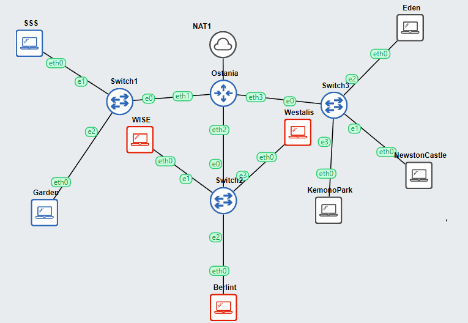

IP Address dari masing-masing node adalah:

    - Ostania   : 192.216.1.1	| DHCP Relay | Router 
    - WISE      : 192.216.2.2	| DNS Server
    - Berlint   : 192.216.3.2	| Proxy Server
    - Westalia  : 192.216.3.3	| DHCP Server
    - SSS           : DHCP	| Client Subnet 1
    - Garden        : DHCP	| Client Subnet 1
    - Eden          : DHCP	| Client Subnet 3
    - NewstonCastle : DHCP	| Client Subnet 3
    - KemonoPark    : DHCP	| Client Subnet 3

### Penyelesaian dan Dokumentasi Soal 1
### Isi File konfigurasi `no1.sh`

### Pada node Ostania
```bash
iptables -t nat -A POSTROUTING -o eth0 -j MASQUERADE -s 192.216.0.0/16
cat /etc/resolv.conf
```

### Pada semua node yang dijadikan server kecuali Ostania
```
echo nameserver 192.168.122.1 > /etc/resolv.conf
```

### Pada node WISE sebagai DNS server
Menginstall bind
```
apt-get update
apt-get install bind9 -y
```
### Pada node Berlint sebagai Proxy server
Menginstall squid
```
apt-get update
apt-get install squid -y
```
### Pada node Westalis sebagai DHCP server
Menginstall isc-dhcp-server
```
apt-get update
apt-get install isc-dhcp-server -y
```

### Kendala Soal 1
Tidak ada

## Soal 2
Mengatur Ostania sebagai DHCP relay

### Jawaban Soal 2
Berupa langkah penyelesaian soal

### Penyelesaian dan Dokumentasi Soal 2
## Isi file `no2.sh` pada ostania
```
apt-get update

apt-get install isc-dhcp-relay 

echo 'net.ipv4.ip_forward=1'>/etc/sysctl.conf

service isc-dhcp-relay restart
```
## Isi file `/etc/default/isc-dhcp-relay`
Menambahkan Ip Westalis sebagai dhcp server tujuan relay dan `eth1 eth2 eth3` sebagai interface yang dilayani
```
# What servers should the DHCP relay forward requests to?
SERVERS="192.216.2.4"

# On what interfaces should the DHCP relay (dhrelay) serve DHCP requests?
INTERFACES="eth1 eth2 eth3"
```
### Dokumentasi
Penyetelan DHCP Relay pada Ostania
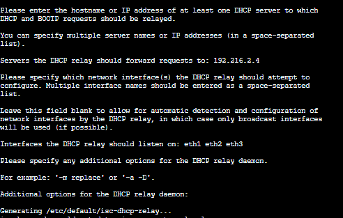

### Kendala Soal 2
Tidak ada

## Soal 3

### Jawaban Soal 3
Berupa langkah penyelesaian soal

### Penyelesaian dan Dokumentasi Soal 3
Client yang melalui Switch1 mendapatkan range IP dari `192.216.1.50` - `192.216.1.88` dan `192.216.1.120` - `192.216.1.155`

Mengedit file `/etc/dhcp/dhcpd.conf`pada node Westalis
```
subnet 192.216.2.0 netmask 255.255.255.0 {
}

subnet 192.216.1.0 netmask 255.255.255.0 {
    range 192.216.1.50 192.216.1.88;
    range 192.216.1.120 192.216.1.155;
    option routers 192.216.1.1;
    option broadcast-address 192.216.1.255;
    option domain-name-servers 192.216.2.2;
    default-lease-time 600;
    max-lease-time 6900;
}
```
Mengedit baris pada file `/etc/default/isc-dhcp-server`
```
INTERFACES=`eth0`
```
Mengedit file `/etc/network/interfaces` pada semua node client
```
auto eth0
iface eth0 inet dhcp
```
Setelah dilakukan perubahan, digunakan perintah
```
service isc-dhcp-server restart
```

Restart node client agar terjadi perubahan, apabila diperlukan atau apabila Lease DHCP gagal dilakukan

### Dokumentasi
Pada node Westalis<br>
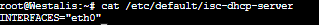
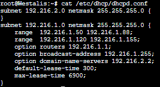


### Testing SSS
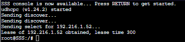

### Testing Garden
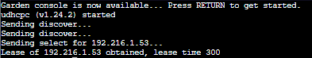

### Kendala Soal 3
Tidak ada

## Soal 4

### Jawaban Soal 4
Berupa langkah penyelesaian soal

### Penyelesaian dan Dokumentasi Soal 4
Client yang melalui Switch3 mendapatkan range IP dari `192.216.3.10` - `192.216.3.30` dan `192.216.3.60` - `192.216.3.85`

Pada file `/etc/dhcp/dhcpd.conf` di node Westalis ditambahkan
```
subnet 192.216.3.0 netmask 255.255.255.0 {
    range 192.216.3.10 192.216.3.30;
    range 192.216.3.60 192.216.3.85;
    option routers 192.216.3.1;
    option broadcast-address 192.216.3.255;
    option domain-name-servers 192.216.2.2;
    default-lease-time 600;
    max-lease-time 6900;
}
```

Setelah dilakukan perubahan, digunakan perintah
```
service isc-dhcp-server restart
```

Restart node client agar terjadi perubahan, apabila diperlukan atau apabila Lease DHCP gagal dilakukan

### Dokumentasi
Pada node Westalis<br>
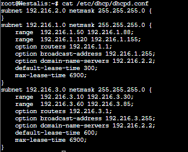

### node Eden
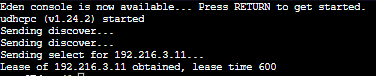

### node NewstonCastle
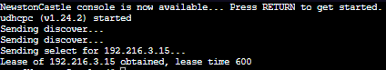

### node KemonoPark
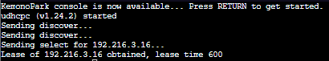

### Kendala Soal 4
Tidak ada

## Soal 5
Client mendapatkan DNS dari WISE dan client dapat terhubung dengan internet melalui DNS tersebut

### Jawaban Soal 5
Berupa langkah penyelesaian soal


### Penyelesaian dan Dokumentasi Soal 5
## Pada node WISE
Mengedit line berikut pada file ‘/etc/bind/named.conf.options`
```
forwarders {
                192.168.122.1;
};

//dnssec-validation auto;
allow-query{any;};
```

Lalu dilakukan
```
service bind9 restart
```

## Dokumentasi
Testing pada node Client <br>
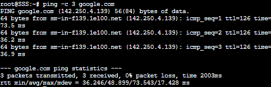

### Kendala Soal 5
Tidak ada

## Soal 6
Lama waktu DHCP server meminjamkan alamat IP kepada Client yang melalui Switch1 selama 5 menit (300s) sedangkan pada client yang melalui Switch3 selama 10 menit (600s). Dengan waktu maksimal yang dialokasikan untuk peminjaman alamat IP selama 115 menit (6900s).

### Jawaban Soal 6
Berupa langkah penyelesaian soal


### Penyelesaian dan Dokumentasi Soal 6
Sudah diberi perintahnya pada langkah sebelumnya, akan tetapi apabila waktu tidak ditambahkan pada soal sebelumnya sebenarnya tidak ada kendala.
```
subnet 192.216.2.0 netmask 255.255.255.0 {
}

subnet 192.216.1.0 netmask 255.255.255.0 {
    ...
    default-lease-time 300;
    max-lease-time 6900;
}

subnet 192.216.3.0 netmask 255.255.255.0 {
    ...
    default-lease-time 600;
    max-lease-time 6900;
}
```

## Dokumentasi
### Node SSS (Switch1)


### Node Eden (Switch3)


### Kendala Soal 6
Tidak ada

## Soal 7
Node Eden mendapatkan alamat IP tetap yaitu `192.216.3.13`

### Jawaban Soal 7
Berupa langkah penyelesaian soal 7


### Penyelesaian dan Dokumentasi Soal 7
## Pada node Westalis
Menambahkan konfigurasi pada `/etc/dhcp/dhcpd.conf`
```

...

host Eden {
    hardware ethernet 82:72:f3:bb:c5:47;
    fixed-address 192.216.3.13;
}
```

Lalu dilakukan 
```
service isc-dhcp-service restart
```


## Pada node Eden
Di mana hardware ethernet merupakan alamat fisik dari Eden. Pada kasus ini, alamat fisik dari eth0 yang ada di Eden adalah `82:72:f3:bb:c5:47`. Alamat ini dapat dicek menggunakan perintah
```
ifconfig
```
Mengedit file `/etc/network/interfaces`
```
auto eth0
iface eth0 inet dhcp

hwaddress ether 5a:b7:3a:2b:e8:be
```

## Pada node WISE
Dilakukan restart pada program bind9 dengan perintah
```
service bind9 restart
``` 
## Hasil testing
Dilakukan pembandingan sebelum dilakukan restart pada bind9 (atas) dan sesudahnya (bawah)
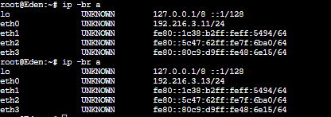

### Kendala Soal 7
Tidak ada

---
## Soal Proxy

### Ketentuan Proxy
1. Client hanya dapat mengakses internet diluar (selain) hari & jam kerja (senin-jumat 08.00 - 17.00) dan hari libur (dapat mengakses 24 jam penuh)

2. Adapun pada hari dan jam kerja sesuai nomor (1), client hanya dapat mengakses domain loid-work.com dan franky-work.com (IP tujuan domain dibebaskan)

3. Saat akses internet dibuka, client dilarang untuk mengakses web tanpa HTTPS. (Contoh web HTTP: http://example.com)

4. Agar menghemat penggunaan, akses internet dibatasi dengan kecepatan maksimum 128 Kbps pada setiap host (Kbps = kilobit per second; lakukan pengecekan pada tiap host, ketika 2 host akses internet pada saat bersamaan, keduanya mendapatkan speed maksimal yaitu 128 Kbps)

5. Setelah diterapkan, ternyata peraturan nomor (4) mengganggu produktifitas saat hari kerja, dengan demikian pembatasan kecepatan hanya diberlakukan untuk pengaksesan internet pada hari libur


Setelah proxy Berlint diatur oleh Loid, dia melakukan pengujian dan mendapatkan hasil sesuai tabel berikut.


|                   Aksi                  |   Senin (10.00)  |       Senin (20.00)      | Sabtu (10.00) |
|:---------------------------------------:|:----------------:|:------------------------:|:-------------:|
| Akses internet (HTTP)                   |         x        |             x            |       x       |
| Akses internet (HTTPS)                  |         x        |             v            |       v       |
| Akses loid-work.com dan franky-work.com |         v        |             x            |       x       |
| Speed limit (128Kbps)                   | Tidak bisa akses | x (Speed Tidak Dibatasi) |       x       |

# Proxy nomor 1
Client hanya dapat mengakses internet diluar (selain) hari & jam kerja (senin-jumat 08.00 - 17.00) dan hari libur (dapat mengakses 24 jam penuh)
## Pada node Berlint
Mengedit file `/etc/squid/squid.conf`
```
acl HARI_KERJA time MTWHF 08:00-17:00

http_port 8080
http_access deny HARI_KERJA
http_access allow all
visible_hostname Berlint
```
## Pada node client
Menginstall lynx
```
apt-get update
apt-get install lynx -y
```
Menjalankan command
```
export http_proxy="http://192.216.2.3:8080"
```

## Hasil testing
### Pada Bukan Hari Kerja

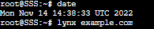

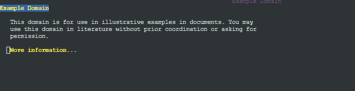


# Proxy nomor 2
Adapun pada hari dan jam kerja sesuai nomor (1), client hanya dapat mengakses domain loid-work.com dan franky-work.com (IP tujuan domain dibebaskan)
## Pada node Berlint
Mengedit file `/etc/squid/squid.conf`
```
acl HK time MTWHF 08:00-17:00
acl WORK time MTWHF 00:00-07:59
acl WORK2 time MTWHF 17:01-24:00
acl HL time AS 00:00-24:00
acl LOID dstdomain loid-work.com
acl FRANKY dstdomain franky-work.com

http_port 8080
http_access allow HK LOID
http_access allow HK FRANKY
http_access deny HK
http_access allow WORK !LOID
http_access allow WORK !FRANKY
http_access allow WORK2 !LOID
http_access allow WORK2 !FRANKY
http_access allow HL !LOID
http_access allow HL !FRANKY
http_access deny all
```

## Pada node WISE
Karena WISE berperan sebagai DNS Server, maka pengaktifan `loid-work.com` dan `franky-work.com` dilakukan dalam node ini

```
apt-get update
apt-get install apache2 -y
apt-get install php -y
apt-get install libapache2-mod-php7.0
```
Mengedit file `/etc/bind/named.conf.local`
```
zone "loid-work.com" {
        type master;
        file "/etc/bind/loid-work/loid-work.com";
};
zone "franky-work.com" {
        type master;
        file "/etc/bind/franky-work/franky-work.com";
};
```
Membuat directory
```
mkdir /etc/bind/loid-work
mkdir /etc/bind/franky-work
```
Mengedit file `/etc/bind/loid-work/loid-work.com`
```
;
; BIND data file for local loopback interface
;
$TTL    604800
@       IN      SOA     loid-work.com. root.loid-work.com. (
                              20221110          ; Serial
                         604800         ; Refresh
                          86400         ; Retry
                        2419200         ; Expire
                         604800 )       ; Negative Cache TTL
;
@       IN      NS      loid-work.com.
@       IN      A       192.216.2.2
@       IN      AAAA    ::1
```
Mengedit file `/etc/bind/franky-work/franky-work.com`
```
;
; BIND data file for local loopback interface
;
$TTL    604800
@       IN      SOA     franky-work.com. root.franky-work.com. (
                              20221110          ; Serial
                         604800         ; Refresh
                          86400         ; Retry
                        2419200         ; Expire
                         604800 )       ; Negative Cache TTL
;
@       IN      NS      franky-work.com.
@       IN      A       192.216.2.2
@       IN      AAAA    ::1
```
Mohon maaf untuk soal selanjutnya tidak sempat kami teruskan karena keterbatasan waktu